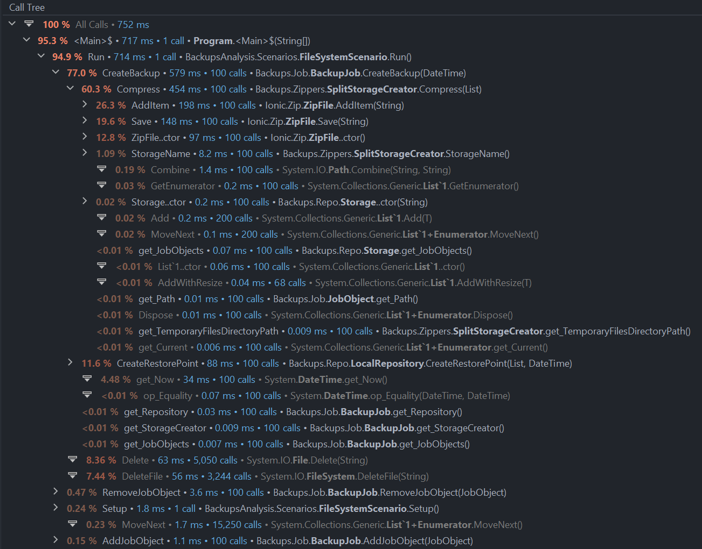
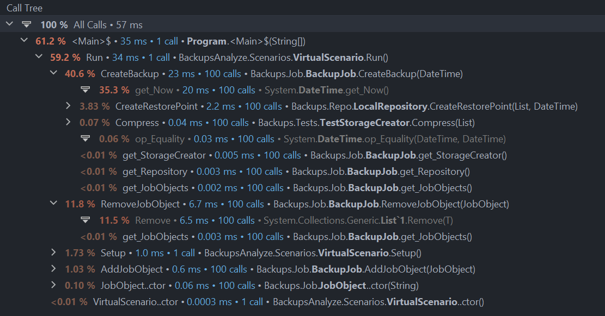

# Знакомство

## 1. Механизм интеропа. Вызов кода C++ из C# и Java

### C++ и C#

Сначала нужно объявить нужные функции в заголовочном файле:
```c++
#ifndef CPPLIBRARY_LIBRARY_H
#define CPPLIBRARY_LIBRARY_H


#define LIBRARY_EXPORT __declspec(dllexport)
extern "C" LIBRARY_EXPORT int Sum(int a, int b);

#endif //CPPLIBRARY_LIBRARY_H
```

Реализация с подключением заголовочного:
```c++
#include "library.h"

extern "C" LIBRARY_EXPORT int Sum(int a, int b) {
    return a + b;
}
```
Соберем библиотеку и подключим в C# проект:
```csharp
using System.Runtime.InteropServices;

[DllImport("lib.dll")]
static extern int Sum(int a, int b);

Console.WriteLine(Sum(1, 2));
```

Мы реализовали функцию в C++, а вызвали в C#. Важно то,
что функции должны иметь одинаковые сигнатуры.

### C++ и Java
```c++
/* DO NOT EDIT THIS FILE - it is machine generated */
#include <jni.h>
/* Header for class com_eeee_Main */

#ifndef _Included_com_eeee_Main
#define _Included_com_eeee_Main
#ifdef __cplusplus
extern "C" {
#endif
/*
 * Class:     com_eeee_Main
 * Method:    sayHello
 * Signature: (I)V
 */
JNIEXPORT void JNICALL Java_com_eeee_Main_sayHello
  (JNIEnv *, jobject, jint);

#ifdef __cplusplus
}
#endif
#endif
```

Опишем функции в .cpp файле.

Обратим внимание на то, что в имени функции нужно
отмечать полный путь итоговой функции.
То есть имя функции начинается с языка - Java, и перечисляет
через нижние подчеркивания все пакеты, классы и,
наконец, идентификатор функции, которая будет ссылаться на этот метод.
Это накладывает большие ограничения на использование.
Код библиотеки сильно завязан на коде, который ее использует.

Возможно, это еще ограничение на нейминг. Возможно, camelCase будет отображаться некорректно. 

```c++
#include "com_eeee_Main.h"

JNIEXPORT void JNICALL Java_com_eeee_Main_sayHello (JNIEnv * env, jobject thisObject, jint x)
{
    std::cout << "Hello " << x << std::endl;
}
```


## 2. Вызов кода Scala из Java и F# из C#

### Scala и Java

Scala:
```scala
import scala.util.chaining.scalaUtilChainingOps

class ScalaClass {
def helloWorld(): Unit = {
println(p(1, 2));
}

def average(a: Int, b: Int): Double = (a + b).toDouble / 2
def double(a : Double) : Double = a * 2

def p(a : Int, b: Int) : Double = average(a, b).pipe(double)
}
```

Java:
```java
public class Main {
    public static void main(String[] args) {
        ScalaClass scalaClass = new ScalaClass();
        scalaClass.helloWorld();
    }
}
```
Код Scala после декомпиляции в Java:

```java
//decompiled from ScalaClass.class
import java.lang.invoke.SerializedLambda;
import scala.Predef.;
import scala.reflect.ScalaSignature;
import scala.runtime.BoxesRunTime;

@ScalaSignature(
   bytes = "\u0006\u000552AAB\u0004\u0001\u0015!)\u0011\u0003\u0001C\u0001%!)Q\u0003\u0001C\u0001-!)!\u0004\u0001C\u00017!)a\u0005\u0001C\u0001O!)\u0011\u0006\u0001C\u0001U\tQ1kY1mC\u000ec\u0017m]:\u000b\u0003!\tq\u0001P3naRLhh\u0001\u0001\u0014\u0005\u0001Y\u0001C\u0001\u0007\u0010\u001b\u0005i!\"\u0001\b\u0002\u000bM\u001c\u0017\r\\1\n\u0005Ai!AB!osJ+g-\u0001\u0004=S:LGO\u0010\u000b\u0002'A\u0011A\u0003A\u0007\u0002\u000f\u0005Q\u0001.\u001a7m_^{'\u000f\u001c3\u0015\u0003]\u0001\"\u0001\u0004\r\n\u0005ei!\u0001B+oSR\fq!\u0019<fe\u0006<W\rF\u0002\u001d?\u0011\u0002\"\u0001D\u000f\n\u0005yi!A\u0002#pk\ndW\rC\u0003!\u0007\u0001\u0007\u0011%A\u0001b!\ta!%\u0003\u0002$\u001b\t\u0019\u0011J\u001c;\t\u000b\u0015\u001a\u0001\u0019A\u0011\u0002\u0003\t\fa\u0001Z8vE2,GC\u0001\u000f)\u0011\u0015\u0001C\u00011\u0001\u001d\u0003\u0005\u0001Hc\u0001\u000f,Y!)\u0001%\u0002a\u0001C!)Q%\u0002a\u0001C\u0001"
)
public class ScalaClass {
   public void helloWorld() {
      .MODULE$.println(BoxesRunTime.boxToDouble(this.p(1, 2)));
   }

   public double average(final int a, final int b) {
      return (double)(a + b) / (double)2;
   }

   public double double(final double a) {
      return a * (double)2;
   }

   public double p(final int a, final int b) {
      return BoxesRunTime.unboxToDouble(scala.util.ChainingOps..MODULE$.pipe$extension(scala.util.package.chaining..MODULE$.scalaUtilChainingOps(BoxesRunTime.boxToDouble(this.average(a, b))), (ax) -> {
         return this.double(ax);
      }));
   }

   // $FF: synthetic method
   private static Object $deserializeLambda$(SerializedLambda var0) {
      return var0.lambdaDeserialize<invokedynamic>(var0);
   }
}
```

### F# и C#

Опишем функцию в проекте на F#:

```f#
module Functions =
    let add num1 num2 = num1 + num2
```

Сделаем референс в C# проекте на F# проект.
Мы можем вызывать код:

```c#
namespace FSharpToCSharp;

class Program
{
    private static void Main()
    {
        Console.WriteLine(global::Program.Functions.add(41, 1));
    }
}
```

F# и C# не могут жить в одном проекте. Проект определяет язык.

## 3. Создание и использование пакетов на C# и Java

Код алгоритма библиотеки C#:

```csharp
namespace EeeeGraphAlgo
{
    public class Algos
    {
        public static void BFS(Node start)
        {
            var queue = new List<Node>();
            var next = new List<Node>();
            
            queue.Add(start);

            while (queue.Count > 0)
            {
                foreach (var node in queue)
                {
                    node.IsVisited = true;
                    next.AddRange(node.Children.Where(child => !child.IsVisited));
                }

                queue = next;
                next = new List<Node>();
            }
        }

        public static void DFS(Node start)
        {
            start.IsVisited = true;

            foreach (var child in start.Children.Where(child => !child.IsVisited))
            {
                DFS(child);
            }
        }
    }
}
```

Проект можно собрать в Nuget Package и добавить в хранилище или сохранить локально.

Получить доступ к нему несложно, пакет легко ищется по имени.

Код алгоритма на Java:

```java
package eeee.dgar;

import java.util.ArrayList;
import java.util.List;

public class Algos
{
    public static void BFS(Node start)
    {
        List<Node> queue = new ArrayList<>();
        List<Node> next = new ArrayList<>();

        queue.add(start);

        while (queue.size() > 0)
        {
            for (Node node: queue)
            {
                node.setIsVisited(true);

                for (Node child: node.children())
                {
                    if (!child.isVisited())
                    {
                        next.add(child);
                    }
                }
            }

            queue = next;
            next = new ArrayList<>();
        }
    }

    public static void DFS(Node start)
    {
        start.setIsVisited(true);

        for (Node child: start.children())
        {
            if (!child.isVisited())
            {
                DFS(child);
            }
        }
    }
}
```

Для сборки пакета на Java нужно использовать средство сборки - Maven или Gradle.
Не так просто и интуитивно, как на C#.

## 4. Анализ алгоритмов сортировки с помощью инструмента Benchmarking

Benchmarking на C#:

```csharp
using BenchmarkDotNet.Attributes;

namespace CSharpBenchmarking
{
    public class Benchmarking
    {
        [Params(100, 1000, 10000, 100000)]
        public int Length;

        private int[] _array;

        [GlobalSetup]
        public void Setup()
        {
            _array = new int[Length];
        }

        [IterationSetup]
        public void IterationSetup()
        {
            var random = new Random();
            for (var i = 0; i < Length; i++)
            {
                _array[i] = random.Next();
            }
        }

        [Benchmark]
        public void QuickSort() => Algo.QuickSort(_array, 0, Length - 1);
            
        [Benchmark]
        public void MergeSort() => Algo.MergeSort(_array, 0, Length - 1);

        [Benchmark]
        public void DefaultSort() => Array.Sort(_array);
    }
}
```

Результаты C#:

```
|      Method | Length |             Mean |          Error |         StdDev |           Median |
|------------ |------- |-----------------:|---------------:|---------------:|-----------------:|
|   QuickSort |    100 |        22.480 us |      2.0615 us |      6.0785 us |        24.000 us |
|   MergeSort |    100 |        25.757 us |      2.2356 us |      6.5212 us |        25.250 us |
| DefaultSort |    100 |         3.360 us |      0.1890 us |      0.5268 us |         3.200 us |
|   QuickSort |   1000 |       261.734 us |     22.6744 us |     65.4208 us |       231.050 us |
|   MergeSort |   1000 |       439.349 us |     28.9409 us |     81.6284 us |       433.250 us |
| DefaultSort |   1000 |        38.240 us |      0.7251 us |      1.6660 us |        37.800 us |
|   QuickSort |  10000 |     3,094.192 us |    319.7393 us |    937.7399 us |     3,038.500 us |
|   MergeSort |  10000 |    20,251.594 us |  1,210.4078 us |  3,568.9148 us |    19,597.350 us |
| DefaultSort |  10000 |       498.987 us |     19.3895 us |     54.0502 us |       477.650 us |
|   QuickSort | 100000 |    23,333.299 us |    948.2569 us |  2,795.9569 us |    22,752.750 us |
|   MergeSort | 100000 | 1,231,465.629 us | 20,201.9599 us | 20,745.9254 us | 1,230,813.600 us |
| DefaultSort | 100000 |     5,903.794 us |    301.1049 us |    878.3372 us |     5,560.400 us |
```

Benchmarking на Java:

```java
package eeee.dgar;

import org.openjdk.jmh.annotations.*;

import java.util.Arrays;
import java.util.Random;
import java.util.concurrent.TimeUnit;

@State(Scope.Benchmark)
@Fork(value = 1, warmups = 1)
@Warmup(iterations = 1)
@BenchmarkMode(Mode.AverageTime)
@OutputTimeUnit(TimeUnit.MILLISECONDS)
public class Benchmarking {
    @Param({"100", "1000", "10000", "100000"})
    public int length;
    public static int[] array;

    @Setup(Level.Invocation)
    public void setUp() {
        array = new int[length];
    }

    @Setup(Level.Iteration)
    public void generate() {
        array = new int[length];
        Random rd = new Random();
        for (int i = 0; i < length; i++) {
            array[i] = rd.nextInt();
        }
    }

    @org.openjdk.jmh.annotations.Benchmark
    public void mergeSort() {
        Algo.mergeSort(array, 0, length - 1);
    }

    @org.openjdk.jmh.annotations.Benchmark
    public void quickSort() {
        Algo.quickSort(array, 0, length - 1);
    }

    @org.openjdk.jmh.annotations.Benchmark
    public void defaultSort() {
        Arrays.sort(array);
    }
}
```
Результаты Java:
```
Benchmark               (length)  Mode  Cnt     Score      Error  Units
Benchmarking.mergeSort       100  avgt    5     0.004 ±    0.001  ms/op
Benchmarking.mergeSort      1000  avgt    5     0.375 ±    0.008  ms/op
Benchmarking.mergeSort     10000  avgt    5    47.476 ±   26.691  ms/op
Benchmarking.mergeSort    100000  avgt    5  3268.220 ± 3377.979  ms/op
Benchmarking.quickSort       100  avgt    5    ≈ 10⁻⁴             ms/op
Benchmarking.quickSort      1000  avgt    5     0.013 ±    0.001  ms/op
Benchmarking.quickSort     10000  avgt    5     0.151 ±    0.038  ms/op
Benchmarking.quickSort    100000  java.lang.StackOverflowError


Benchmark                 (length)  Mode  Cnt   Score    Error  Units
Benchmarking.defaultSort       100  avgt    5  ≈ 10⁻⁴           ms/op
Benchmarking.defaultSort      1000  avgt    5  ≈ 10⁻⁴           ms/op
Benchmarking.defaultSort     10000  avgt    5   0.006 ±  0.001  ms/op
Benchmarking.defaultSort    100000  avgt    5   0.093 ±  0.009  ms/op
```


## 5. Анализ кода бэкапов с помощью инструмента dotTrace

[ООП проект с бэкапами](https://github.com/is-oop-y24/eeeedgar/tree/master/Backups)

Напишем сценарии для создания бэкапов.

Запустим сценарий на реальной файловой системе и проанализируем с помощью dotTrace.



Основное время работы - функции сжатия файлов, полезная работа.

Запустим сценарий на виртуальной файловой системе и тоже проанализируем с помощью dotTrace.



Основное время работы - получение системного времени для записи времени создания точки сохранения.
Может закрасться мысль, что получение времени тут излишне, ведь наверняка оно используется для генерации имени папки или архива, но нет.
Для имен использутся Guid, генерация которого занимает куда меньше времени, а использование в качестве имени - меньше проблем.
Вместе с тем знать время создания точки сохранения довольно полезно, поэтому тоже будем считать эту нагрузку полезной.

Итого, по-моему мнению, бэкапы были написаны неплохо и в исправлениях на данном этапе не нуждаются.