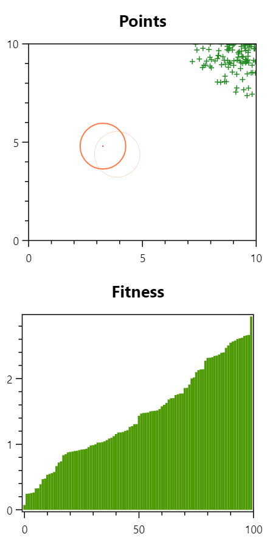
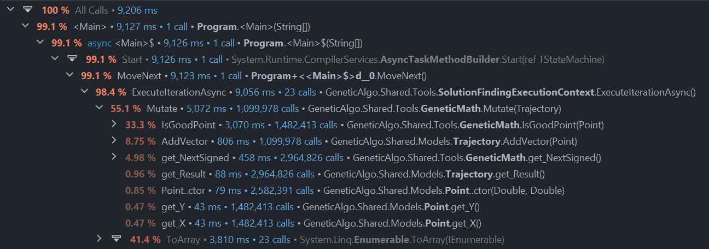
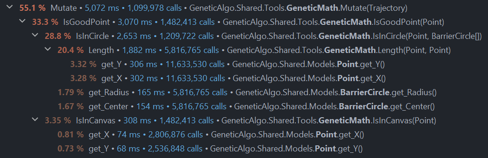
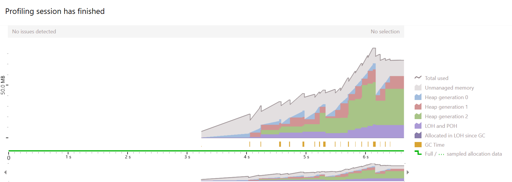
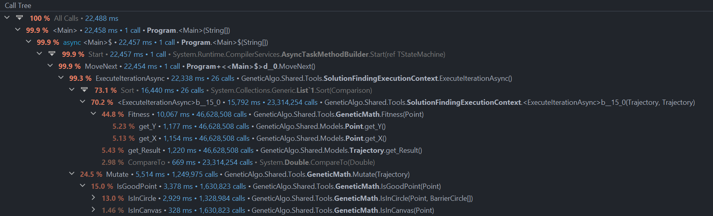
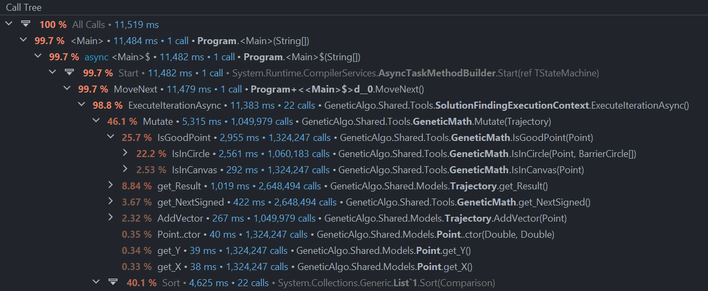
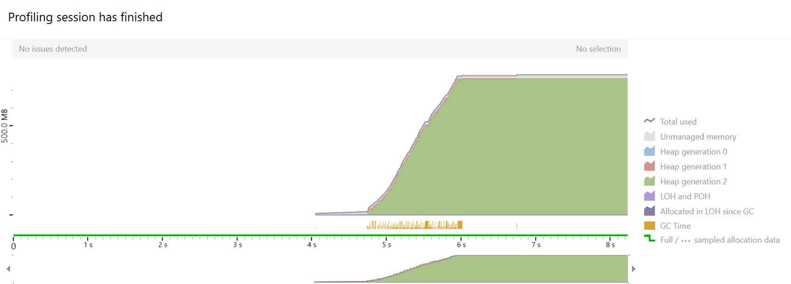

# Сборщик мусора. Генетический алгоритм

## Этап 1

### Написание минимальной работающей программы

Был использован [шаблон из организации](https://github.com/is-tech-y24-1/GeneticAlgoTemplate).

Задача - найти маршрут из одной точки в другую, избегая препятствия.

Для этого помимо сущностей, представленных в шаблоне, была создана новая - траектория *(Trajectory)*.
Она представляла из себя список векторов - перемещений точки на каждой итерации.

В новом решении каждое перемещение для каждой из точек считается случайным образом с условием, что точка не выйдет за границы холста и не попадет в препятствие.

Обнаружив, что отрисовка круглых препятствий не зависит от их радиуса, исправим это. Теперь фактический радиус круга соответствует толщине его обводки.

## Этап 2

### Анализ работы программы с помощью dotTrace и dotMemory

Для анализа производительности генетического алгоритма напишем реализацию его запуска без UI.

Видим, что более 40% времени занимает функция ToArray() - очень плохо, надо оптимизировать.

Возможное решение - использовать такие структуры, чтобы не требовалось постоянное копирование массива.

Видим, что сборщик мусора часто работает - очень плохо, надо фиксить.

Возможное решение - использование таких структур, чтобы не требовалось пересоздавать долгоживущие объекты.

## Этап 3

### Оптимизация решения

#### Проблема 1

Одна из проблем заключалась в том, что при сортировке массива траекторий приходилось вызывать метод ToArray(), что занимало и время, и требовало много памяти.
Решение - хранить траектории в списке. Список траекторий постоянен, поэтому проблемы копирования при увеличении листа не будет.

Теперь много времени уходит на подсчет фитнес-функции. Исправим это, считая фитнес для каждой траектории только один раз за итерацию и храня его полем.

Стало лучше!

#### Проблема 2

Теперь будем избавляться от частого создания долгоживущих элементов.

Сейчас точки траекторий хранятся в списке. На каждой итерации к списку добавляется новая точка, списки не влезают в рамки, из-за чего регулярно создаются новые.

Как от этого избавиться? На каждой итерации мы добавляем к траектории по одной точке. Зная заранее максимальное количество итераций, мы знаем также и максимальное количество точек в траектории, значит, можем хранить точки в массиве.

Отлично, у сборщика мусора почти нет работы, нам не нужно лишний раз тратить ресурсы.